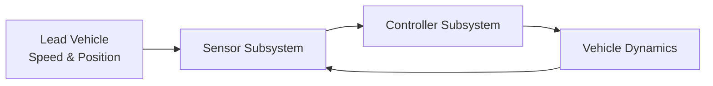

# Adaptive Cruise Control (ACC) System - Design Overview

---

## 1. Introduction

This document provides a detailed overview of the Adaptive Cruise Control (ACC) system design, verification approach, cybersecurity considerations, and optional neural network integration.

---

## 2. System Architecture

The ACC system consists of three main subsystems:

- **Sensor Subsystem:** Simulates radar/lidar distance measurements.
- **Controller Subsystem:** Implements decision logic using Stateflow.
- **Vehicle Dynamics Subsystem:** Models the car's acceleration, braking, and speed.

### High-Level Block Diagram

---

## 3. Subsystem Details

### 3.1 Sensor Subsystem

- Measures relative distance and speed to the lead vehicle.
- Adds noise or attack signals (for cybersecurity testing).
- Outputs sensor data to the controller.

### 3.2 Controller Subsystem

- Implemented using **Stateflow**.
- States:
  - **Cruise:** Maintain set speed.
  - **Follow:** Adjust speed to maintain safe distance.
  - **Brake:** Decelerate if too close.
- Inputs:
  - Relative distance
  - Relative speed
- Outputs:
  - Acceleration or braking commands.

### 3.3 Vehicle Dynamics Subsystem

- Models longitudinal vehicle behavior.
- Integrates acceleration to update speed and position.
- Responds to control commands.

---

## 4. Verification Approach

### 4.1 Tools

- **Breach** and **S-TaLiRo** for formal verification.
- **Signal Temporal Logic (STL)** to specify safety properties.

### 4.2 Example STL Properties

- **Safe Distance:** `G (distance > 5)`
- **Speed Limit:** `G (speed <= 30)`
- **Smooth Acceleration:** `G (|acceleration| < 3)`

### 4.3 Process

1. Define STL properties.
2. Run simulations with varied scenarios.
3. Use falsification to find counterexamples.
4. Analyze and repair the model if violations occur.

---

## 5. Cybersecurity and Fault Tolerance

### 5.1 Attack Scenarios

- **Sensor Spoofing:** Fake distance readings.
- **Data Injection:** Altered control commands.

### 5.2 Simulation

- Inject attack signals into the sensor subsystem.
- Observe system response.

### 5.3 Mitigation

- Add anomaly detection logic.
- Implement safe fallback modes.
- Verify safety properties under attack conditions.

---

## 6. Neural Network Controller (Optional)

### 6.1 Design

- Train a neural network to mimic or enhance the rule-based controller.
- Use driving data or simulation traces.

### 6.2 Integration

- Import the trained network into Simulink using the **NNV toolbox**.
- Replace or augment the existing controller.

### 6.3 Verification

- Use NNV to verify robustness and safety.
- Compare performance with traditional controller.

---

## 7. Future Work

- Complete formal verification scripts.
- Develop cybersecurity attack models.
- Train and integrate neural network controller.
- Expand documentation and test cases.

---

## 8. References

- [Breach Toolbox](https://github.com/decyphir/breach)
- [S-TaLiRo](https://sites.google.com/a/asu.edu/s-taliro)
- [NNV Toolbox](https://github.com/verivital/nnv)
- [MathWorks Simulink](https://www.mathworks.com/products/simulink.html)
- [MathWorks Stateflow](https://www.mathworks.com/products/stateflow.html)

---

*This document can be converted to PDF for sharing and presentation purposes.*
